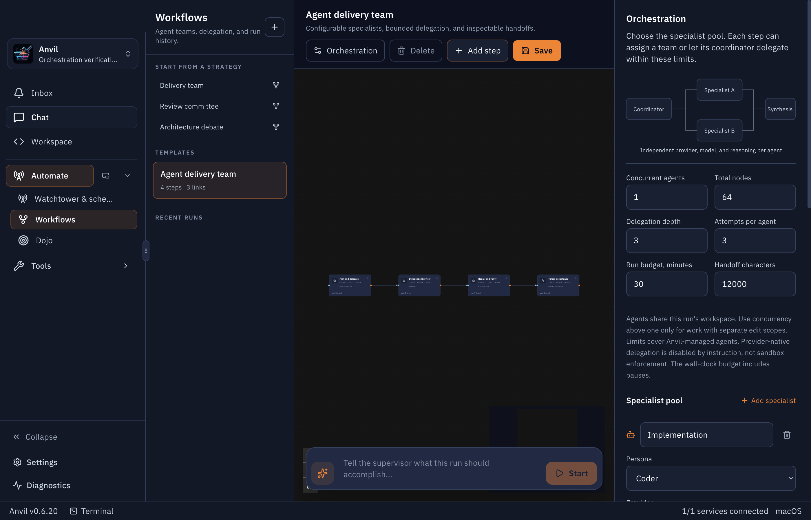
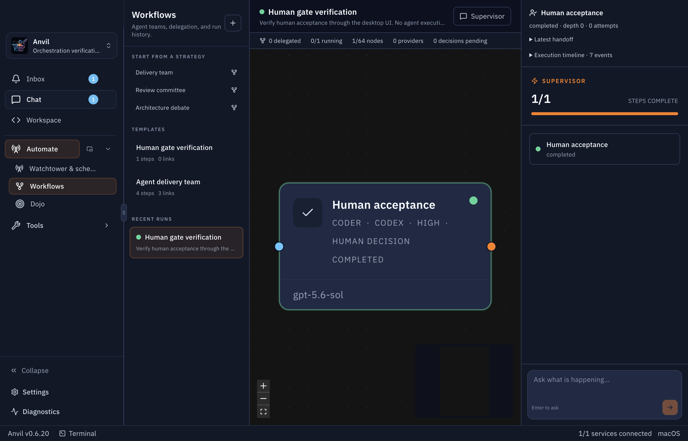

# Agent orchestration

Implemented on `feature/orchestration--runtime-expansion`.

## What changed

Anvil now owns cross-provider delegation inside Workflows. A coordinator can assign specialist tasks, wait for their results, and return for synthesis. Specialists can delegate again within the configured depth and attempt limits. Each specialist appears in the live graph with its own provider, model, reasoning, thread, and attempt history.

| Capability | Behaviour |
|---|---|
| Specialist profiles | Configure persona, provider, model, reasoning, and capabilities. |
| Single agent | Run the step's configured agent directly. |
| Map / reduce | Run assigned specialists, then synthesise their handoffs. |
| Independent review | Inspect common inputs separately, then reconcile findings. |
| Debate | Produce independent alternatives, then compare tradeoffs. |
| Autonomous delegation | Let the coordinator select tasks and approved profiles. |
| Runtime limits | Bound active agents, graph size, delegation depth, attempts, elapsed time, and handoff text. |
| Live graph | Display delegated nodes and dependency columns as the graph grows. |
| Attempt history | Preserve provider/model/reasoning, output, errors, and thread references. |
| Human decisions | Persist acceptance or rejection with a note. |
| Run controls | Pause dispatch, resume, cancel, and explicitly retry failed or interrupted work. |
| Recovery | Detect exited owners and pause uncertain work instead of replaying it. |
| Automations | Launch a workflow from a schedule or Watchtower in existing automation worktrees. |

Existing templates remain readable. Legacy provider-delegation hints remain available to existing templates; new team strategies use Anvil-managed delegation.

## Try it

1. Open **Automate → Workflows → Delivery team**.
2. Open **Orchestration** and configure the implementation, review, and verification specialists. Only enabled providers can execute.
3. Select a graph node to choose its team strategy and permitted specialists.
4. Set runtime limits, save, and enter the kickoff. Starting saves the current configuration first.
5. Select a running node to inspect its handoff and attempts. Use the timeline to see why tasks appeared or failed.
6. At a human gate, select the node, record a decision, and resume.

For scheduled or event-driven execution, select the saved template in an automation's **Workflow execution** field. Workflow mode and persona-loop mode are mutually exclusive. Workflow automations currently require write and command permissions. The automation run includes an **Open workflow graph** action.

## Operational details

Default limits are one concurrent agent, 64 nodes, delegation depth three, three attempts per agent, 30 minutes, and 12,000 handoff characters. Pauses count toward the deadline. Manual retries and autonomous synthesis share the attempt budget.

Agents share a run workspace. Direct workflows use the selected repositories; automation workflows use retained automation worktrees. Raise concurrency only when edit scopes are separated. This release does not automatically merge isolated implementation branches.

Anvil enforces limits for its own managed nodes. Provider-native delegation is controlled by instructions, not sandbox enforcement. Provider approval requests fail with an actionable error rather than waiting indefinitely. Existing provider-specific timeouts still apply.

Handoffs identify their source node and attempt, but remain agent reports. This release does not add snapshot-bound acceptance evidence, hard token/currency budgets, quorum voting, or invocation of saved workflows as nested nodes. Recursive specialist delegation is implemented.

Automation-generated workflow events do not start another automation. This prevents unattended feedback loops. Human-paused workflow worktrees remain available for continuation.

## Verification

- 619 tests pass across 110 test files.
- Production build and ESLint pass.
- Full TypeScript checks still report unrelated repository errors; no diagnostics reference the changed orchestration files.
- Isolated Electron verification covered starter creation and persistence, workflow navigation, human acceptance, resume, completion, and persisted decision history. No browser errors were reported.
- Cross-provider execution and recursive delegation were tested with controlled workers. A paid end-to-end run across multiple live providers was not performed.

## Screenshots

