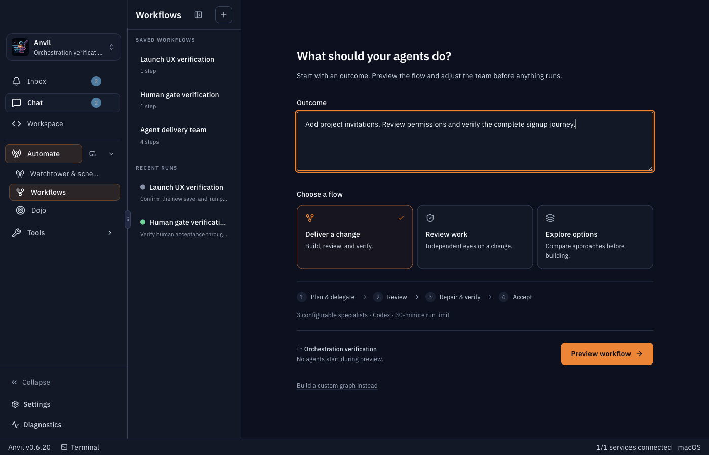
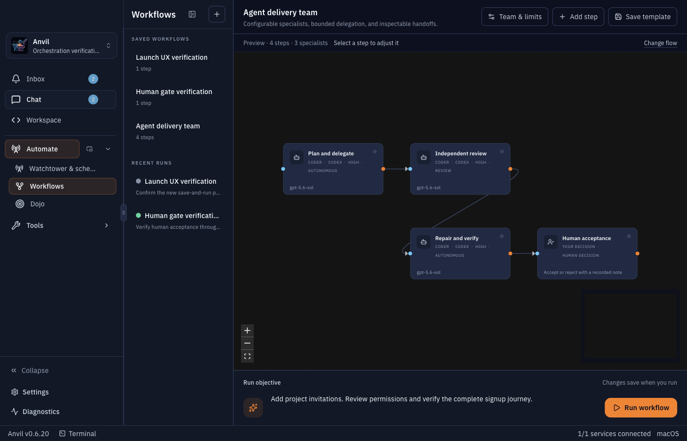
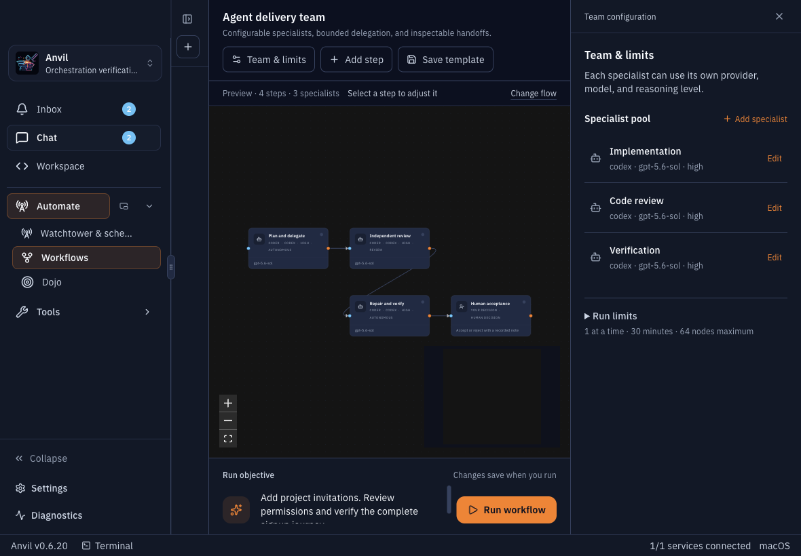

# Workflow UX refinement

The first implementation exposed too much configuration before the user had described a job. Its long settings panel competed with the graph, and starting a new flow required a separate save step.

The revised path is:

**Describe the outcome → Choose a flow → Preview → Run**

## Changes

- A focused launch screen offers delivery, review, or exploration, with a short stage preview.
- Preview starts no agents and keeps the objective available for editing.
- Run workflow saves the current configuration automatically. Saving a reusable template remains optional before launch.
- Team configuration starts closed. Specialists expand individually, and runtime limits stay behind a disclosure.
- The delivery graph uses a compact layout. Its objective and primary run action have a dedicated footer.
- The workflow library collapses below 1280px and can be toggled manually.
- Human nodes display a decision rather than irrelevant provider/model metadata.
- Loading configuration has an explicit retry path, and refreshing configuration no longer replaces a draft with a saved template.

## Verification

Inspected the real Electron interface at 1400×900 and 1180×820 in an isolated profile. A human-only workflow launched directly from an unsaved draft, created exactly one template, preserved its objective, and paused at its decision node.

619 tests pass. Production build and ESLint pass. The renderer TypeScript check retains unrelated repository errors; none reference the changed workflow components.

## Screenshots

