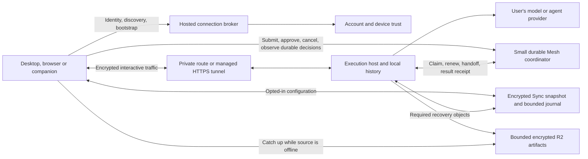

# Host-local execution and low-cost Sync and Mesh

Prepared 4 October 2026. Status: implementation authorised and in progress.

The user confirmed that hosted Sync/Mesh is completely greenfield. Require current clients for the
new protocol. Destructive resets of test hosted state are allowed; do not build legacy-client
migration or historical rollback readers. Repository files, local credentials and unrelated local
work remain outside those resets. Preserve the security and recovery guarantees for new data.

This is the implementation direction for reducing the running cost of free Sync and Mesh. It
supersedes the future transport recommendation in the
[product and monetisation plan](mesh-access-and-monetisation-plan.md). That document remains the
record of the approved free offering and the initial PR91 changes. The
[FinOps projection](finops-projection.md) and workbook compare the original architecture with the
full host-local design. Keep projected usage separate from measured deployment costs.

## Outcome and boundaries

Run agents, serve interactive operations, and retain detailed execution history on the machine
doing the work. Use Anvil's hosted service for identity, device discovery, connection bootstrap,
compact workspace Sync, and the durable decisions that let Mesh survive disconnects and move work
between machines. Routine live traffic should bypass Anvil's application Worker and account
coordinator once the client has connected to its execution host.

Sync and Mesh stay free. Users can run work on their own desktops, servers and machines in their
cloud accounts, or use supported provider cloud agents. Provider bills remain theirs. Only future
Anvil Cloud Agents, the execution machines supplied by Anvil, are a paid offering. Keep that feature
disabled in PR91. Anvil Cloud remains the framework's name.

The cost objective is a small fixed hosting bill at low adoption and low marginal cost as usage
grows. It is not a promise of zero infrastructure cost. Preserving offline delivery, revocation,
fencing and recovery takes priority over hitting an illustrative budget.

Keep these product rules:

- No master desktop. Any trusted execution host can own a job; the hosted coordinator arbitrates
  ownership across hosts.
- Workspace Sync is optional, with Local as the default for newly created workspaces. Existing
  bindings survive pausing and resuming Sync. Remote task preparation does not silently enable ongoing Sync.
- Sync covers portable definitions, selected settings, templates and custom agents. Repository
  files, provider credentials, machine paths and chat transcripts are outside workspace Sync.
- Personal Sync and Mesh do not require an organisation. Current organisations manage membership,
  roles and invitations; shared organisation fleets and workspaces are a separate feature.
- Keep private routes, local pairing and self-hosted backends available. Preserve current free
  device/member allowances and resource limits until a separate capacity decision changes them.

Deployment, tunnel purchases and launching paid Cloud Agents remain separate operational steps.
Keep retention explicit for newly accepted data; a test-state reset is not a retention policy.

## Starting point

The working branch already contains the initial free-access changes, per-workspace Sync choice,
Cloud Agent flags, website copy and shared renderer polling. These are distinct from this redesign.
The default-off `ANVIL_MESH_MACHINE_ENDPOINTS` prototype exposes machine information and wakes
approved coordinator-owned commands. It is not a complete direct execution or streaming protocol.

| Area | Current implementation to extend | Required change |
| --- | --- | --- |
| Hosted account state | `cloud/backend/src/account-coordinator.ts` | Separate durable decisions from detailed progress and compact Sync history |
| Authentication and session state | `cloud/backend/src/session-coordinator.ts`, `cloud/backend/src/hosted/` | Retain trust checks while removing repeated database work from individual host operations |
| Host entry point | `src/main/services/mobile-companion.service.ts`, `mesh-machine-endpoint.service.ts`, `dashboard-grant.service.ts` | Add authenticated, versioned live operations without weakening existing local listener restrictions |
| Execution and fencing | `mesh-worker.service.ts`, `mesh-dispatch.service.ts`, `mesh-ownership.service.ts`, `mesh-handoff.service.ts` | Preserve coordinator ownership while moving progress transport and history to the host |
| Remote reads and writes | `remote-chat.service.ts`, `mesh-observe.service.ts`, `mesh-command.service.ts` | Host streams with cursor recovery, explicit acknowledgements and compatible fallback |
| Portable data | `sync-engine.service.ts`, `sync-persistence.service.ts`, `sync-runtime.service.ts`, `sync-recovery.service.ts` | Encrypted snapshots plus a bounded change journal with safe recovery |
| Artifact delivery | `mesh-artifact.service.ts` and backend artifact handlers | Private transfer where suitable; retain bounded off-host recovery for required results |
| Client state | Shared contracts, IPC/preload, renderer, `mobile/`, `raycast/` | One connection/cache per scope, explicit capabilities and reconnect states |

Service filenames without a directory in this table are under `src/main/services/`. Paths are
relative to `anvil-app/`. Read each project's instructions before its implementation work.

## Target architecture

A managed tunnel remains a provider-proxied route. It avoids Anvil application relay processing;
it does not make the connection physically peer-to-peer. Keep application encryption for sensitive
payloads across public proxies. Use private connections or suitable object storage for bulk transfer.
[Cloudflare routing](https://developers.cloudflare.com/tunnel/concepts/routing/).

### Where state lives

| State | Authority and persistence | Availability requirement |
| --- | --- | --- |
| Account lifecycle, enrolments, roles, device/key epochs | Existing hosted trust services | Required for new grants and authoritative account decisions |
| Machine identity, endpoint generation, capabilities | Durable broker record; transient reachability | Offline must not mean unlinked or deleted |
| Accepted jobs, owner/attempt generations, leases, approval and cancellation decisions | Durable account coordinator | Survives the submitter closing and coordinator eviction |
| Handoff state, checkpoint reference, terminal result receipt | Durable coordinator and required encrypted recovery object | Recoverable if the previous host disappears |
| Live output, terminal traffic, working files, detailed local execution history | Execution host | Host must be reachable for live operations; expose this state in clients |
| Portable workspace configuration | Latest encrypted snapshot plus subsequent bounded changes | A trusted device can recover while all previous devices are offline |
| Required artifacts and bounded durable activity history | Encrypted object storage plus indexed manifests/receipts | Preserve the current retention and offline-read contract |

Moving detailed history off the coordinator must not silently turn existing durable activity into
host-only data. Classify each existing event first. Keep authoritative events centrally; archive any
currently promised offline-readable detail into encrypted segments before removing its coordinator
copy. Only genuinely ephemeral output and data already local today can remain exclusively local.
Price those archive objects separately from compact workspace Sync.

## Connection and trust protocol

1. A host enrols through the existing account/device trust flow. It advertises a stable machine ID,
   endpoint generation, protocol versions and capabilities. Reachability has an expiry; identity does
   not disappear just because a laptop sleeps.
2. A client discovers authorised hosts, then requests a short-lived bootstrap for one host and scope.
   Bind it to the account, source device, destination host, endpoint generation, proof key, allowed
   operations and expiry. Consume the bootstrap once and reject replay or target substitution.
3. Dial a supported private route first. Use a managed HTTPS endpoint when available, then the
   compatible hosted fallback. Respect browser secure-context, certificate and local-network
   restrictions; a route working in Electron is not proof that it works in a browser.
4. The host verifies the proof and issues a narrowly scoped session. Validate sequence numbers and
   request IDs locally. Do not put reusable account tokens in URLs, browser storage or logs. Retain
   existing payload encryption and local observe/approve/steer boundaries.
5. Keep revocation at least as strong as the existing approximately 60-second attestation window.
   Push invalidation when connected; use expiring authorisation when that channel fails. A suspended
   or disconnected host must not keep accepting account-authorised mutations indefinitely.
6. On reconnect, revalidate trust and resume from an acknowledged stream cursor. An expired cursor
   produces an explicit resnapshot response, never silent loss of events. A host restart creates a
   new stream epoch; old sessions cannot be replayed into it.

Host-local verification removes a hosted lookup for each file read or streamed frame. It does not
remove the hosted work needed to refresh authorisation and enforce revocation. Budget refreshes by
active host/session count and connected hours; coalesce only when the security contract permits it.

Extend the current private listener separately from a public tunnel adapter. The prototype rejects
forwarded authority headers; do not disable that protection to make tunnels work. Give the managed
adapter a verified ingress configuration, exact allowed origins, authenticated upgrades, request
size limits, rate limits and a loopback-only upstream. The broker must not fetch arbitrary client
URLs or permit cross-account endpoint advertisements.

Use WebSockets for bidirectional host traffic. SSE can remain an HTTP-compatible read-only event
adapter if a client requires it, but does not replace terminal input or command acknowledgements.
Hosted notifications should use hibernating Durable Object sockets, short handlers and no open
background I/O. A socket alone does not establish successful hibernation; inspect actual duration.
[Cloudflare WebSocket guidance](https://developers.cloudflare.com/durable-objects/best-practices/websockets/).

## Execution, ownership and recovery

Keep job submission and acceptance durable. A client may send task content directly to its host,
but the host must hold the accepted job's current attempt fence before executing managed work.
Record acceptance before acknowledging success to the submitter. Retries reuse a request ID and
return the existing receipt; switching transports must not dispatch another attempt.

Keep these existing lease constants for the new protocol:

- Attempt ownership lasts 120 seconds and renews every 30 seconds.
- Worker incarnation lasts 90 seconds.
- Renewal, completion, approval and handoff checks continue to enforce the correct generations.

The constants are in `cloud/contract/version.ts`. A persistent socket is not an ownership lease.
Batch renewals on the existing cadence and carry them over a hibernating control socket where
supported. Changing transport can reduce request overhead, but durable renewal writes still count.
Do not suppress a changed expiry as an "unchanged heartbeat" or acknowledge an extension before it
is durably committed. A lease redesign is a separate protocol decision after measurement.

When authority cannot be renewed, stop starting new fenced work and follow the existing expiry and
unknown-outcome rules. Stop local processes where possible and expire scoped credentials. An
external side effect already sent to a provider cannot always be undone or fenced remotely. Preserve
unknown outcomes and reconciliation; do not claim exactly-once execution or automatically retry an
ambiguous mutation on another machine.

Deliver cancellation and approvals as durable decisions with host acknowledgements. A local click
is not confirmation that the remote process stopped. Keep durable offline queues and bounded retry
backoff. Online notifications should wake the relevant host without scanning every user's queue.
Inventory queue expiry, capacity and failure behaviour before replacing any polling path. The
current worker also performs one `job.get` per active attempt on each 30-second renewal tick;
replace these cancellation polls with push plus durable catch-up before considering longer leases.
The default job queue deadline is ten minutes; preserve its expiry behaviour.

Terminal jobs and attempts are not currently removed by the sweep. Define a compact terminal
record before bounding this growing stock. Retain account/source-device ID, request ID, payload
hash, job ID, last attempt/fence, terminal outcome and time, plus result/archive references. Keep
the deduplication tombstone for the account lifetime, preserving the current
unbounded retry horizon while reducing record size. Include that growing stock in the model.
A finite horizon would need an explicit protocol epoch/expiry rule that rejects old requests even
after their tombstones are gone; it is not part of the initial compaction. Preserve result lookup
and artifact/event scope checks independently of whether detailed history has expired.

Keep the existing handoff state machine. The source quiesces, produces a sealed checkpoint, and
publishes its recoverable reference before ownership transfers. The target activates only after the
generation changes. Provider adapters still declare native resume, checkpoint import or summary
continuation; a connection redesign does not make an arbitrary provider process portable.

## Compact free Sync

Use the existing encrypted entity format and conflict semantics. Add a versioned snapshot manifest
containing account/dataset epoch, key epoch, schema version, committed cursor, object digests and
entity/tombstone coverage. An authorised client builds encrypted snapshot chunks; the server does
not need plaintext access to compact portable configuration.

Publish snapshots through this sequence:

1. Read a stable committed version and build a complete snapshot of current portable state,
   including the deletion information needed to prevent resurrection. Batch edits and use bounded
   chunks so a single change does not rewrite a large account snapshot.
2. Upload immutable encrypted objects with checksums and idempotent object names. Verify all chunks
   exist before publication. Concurrent changes stay in the journal after the snapshot cursor.
3. Compare-and-swap the authoritative manifest against the captured epoch and cursor. Reject stale
   writers and key changes. Validate publisher capability and object bounds; incomplete or malicious
   uploads must not become a recovery source merely because the uploader is enrolled.
4. Download and verify recovery through the normal reader into an isolated local staging database,
   then advance a compaction watermark. This also works for accounts with one device. Cross-device
   recovery tests are a rollout gate, not a requirement for two online devices on
   every publication. Retain the previous verified snapshot and required journal tail throughout
   the repair window. Clients fetch the snapshot and tail; old cursors get an explicit recovery
   instruction.
5. Garbage-collect unreferenced chunks after a grace period. Delete only data covered by a verified
   recoverable snapshot. Account deletion and key
   rotation must cover all retained snapshot generations, temporary uploads and archives.

Require the current protocol when enabling snapshots. Do not build older-host adapters or
released-client upgrade paths for this greenfield feature. Keep existing scan machinery where it
provides stable staging and recovery. A long-offline device rebases its pending
changes through the conflict rules instead of replaying stale state over deletions.

The existing journal, tombstones and push receipts have a 90-day retention contract. Keep that
contract during initial compaction. A push whose old receipt expired is an uncertain write, not a
safe retry: retain the local outbox, conflicts and quarantine until reconciliation or explicit
resolution. Preserve the exact intent and request identity; do not mint a replacement ID to replay
an uncertain write. Preserve staged scan, catch-up to a finish watermark and atomic activation. Snapshot
publication does not itself replace push receipts or prove that an uncertain client mutation landed.

Snapshot compaction must not depend on one nominated machine. Any appropriately trusted capable
device can publish; the coordinator serialises publication. When no such device is online, retain
the recoverable journal/state and charge for that storage. Do not delete it to meet the 1 MB planning
assumption. Existing synced workspaces remain recoverable while all source devices are offline.

Preserve Local/Sync selection through creation, import, materialisation and account switching.
Stopping Sync pauses further workspace replication. Re-enabling reconciles changes. Removing hosted
copies is a separate explicit action; compaction must not turn an opt-out into a deletion or adopt an
unsynced local workspace.

## Artifacts and managed endpoint lifecycle

Transfer bulk artifacts over an authenticated private route where both endpoints are available.
If completion, handoff or offline recovery requires an off-host object, upload and verify it before
publishing the durable receipt. A peer-transfer acknowledgement does not substitute for promised
recovery while that peer is offline. Keep checksums, encrypted manifests, expiry and download scope.

The current backend limits Mesh artifacts to 64 MiB each, with seven-day default and 30-day maximum
retention. The 512 MiB aggregate account cap applies to self-hosted deployments; hosted accounts use
operator-mediated fair use without that hard aggregate cap. Preserve these semantics during
implementation and explicitly propose any new hosted storage ceiling, including its UX and treatment of
existing data. Inventory share objects and other recovery data separately; they may have different
policies. R2 fallback and durable history archives need separate budgets from workspace Sync.

Current intermediate activity has a 1 MiB per-job budget with explicit gap events; durable lifecycle
events bypass that budget. Add an explicit retained-event floor and archive coverage to `event.pull`
before deleting old rows. Otherwise TTL deletion can make an incomplete history look complete.
Retain job event cursors and distinguish replay from archive, expired history and genuinely empty
history. Preserve the current 90-day event retention.

Managed endpoints need a durable allocation state machine:

`unallocated -> allocating -> ready -> retiring -> unallocated`, with retryable failure states.

Use a stable host identity and a distinct allocation generation. Persist operation IDs before
external creation, reconcile uncertain outcomes, and make cancellation/cleanup idempotent. Never
publish a hostname whose credential or generation no longer matches the host. Deleting an
allocation revokes its credentials and removes associated routes/DNS resources without deleting the
device identity. Reclaim offline allocations only after a documented grace period and a race-safe
generation check; laptop sleep should not create allocation churn on every reconnect.

Allocate for exposed execution hosts, not viewers. Support user-supplied private/HTTPS routes.
Bound concurrent provisioning and retry with jitter. Keep provider credentials in the hosted
allocation service, with host-specific connector credentials on each host. On capacity failure,
show a useful connection state and retain compatible fallback.

Confirm commercial pricing, allowed traffic, DNS/certificate capacity and allocation limits before
managed rollout. Published defaults include 1,000 tunnels and 1,000 combined private routes per
account; these are distinct resources and do not establish a supported public hostname count or a
price for this deployment. Do not base scaling on creating extra accounts to evade quotas.
[Cloudflare limits](https://developers.cloudflare.com/cloudflare-one/account-limits/),
[Tunnel overview](https://developers.cloudflare.com/tunnel/).

## Delivery sequence

Each row is a reviewable increment. Proposed gates below are capability/rollout concepts, not
existing configuration keys unless explicitly named. Keep new paths off until their acceptance
checks pass. Extend typed contracts end to end through main services, IPC, preload and clients.

| Increment | Deliverable and main code area | Acceptance and dependency |
| --- | --- | --- |
| 0. Baseline and capability contract | Meter backend operations, duration, storage and fallback by feature. Inventory every durable record and its recovery contract. Define host protocol, stream epochs and capabilities in `cloud/contract/` and shared types. | Reproduce current same-workload costs; agree the feature-preservation matrix below. No traffic migration. |
| 1. Private host sessions | Extend machine endpoint, companion listener, grant service and device trust with scoped bootstrap, proof verification, revocation and session expiry. | Two devices connect privately; replay, cross-account access, revoked devices and forged authority fail. Uses the existing default-off endpoint gate. |
| 2. Direct interactive traffic | Route remote reads, live output and commands through host sessions. Add local cursor replay, bounded buffers and one shared client subscription/cache. Retain centrally accepted jobs. | No duplicate commands on reconnect or route change; live output bypasses application relay. Desktop, browser and companion capability differences tested. Depends on 1. |
| 3. Small durable Mesh state | Classify events, preserve ownership/queues/approvals/results, archive promised history, batch control traffic and remove redundant hosted status polls. Extend account coordinator, worker, observe and handoff services. | Partition, crash, eviction and handoff tests preserve fences and offline recovery. Lease cadence unchanged. Depends on 0 and 2. |
| 4. Compact Sync storage | Add snapshot manifests, encrypted chunks, conditional publication, recovery, compaction watermark and delayed cleanup. Extend engine, persistence, recovery, backend and schema migrations. | Long-offline/new-device recovery, conflicts, tombstones, rotation and opt-out pass before deletion is enabled. Can proceed alongside 2/3 after 0. |
| 5. Managed reachability | Add the public ingress adapter and allocation/reconciliation service with generation fencing, revocation and bounded cleanup. | Tunnel commercial/capacity review complete; browser/mobile connection and sleep/reconnect verified. Depends on private host sessions and direct traffic. |
| 6. Protocol cutover and staged rollout | Require current capability profiles, add feature metrics and support diagnostics, and exercise current clients and self-hosted deployments. Update documentation and copy as capabilities ship. | Unsupported profiles fail clearly; stable cost and recovery measurements at each cohort; no new-data deletion before verified snapshot/archive recovery. |

Do not expand Cloud Agent provisioning as part of managed reachability. A tunnel to a user-owned
machine is not an Anvil-supplied execution machine. If an implementation touches owned Effect
orchestration internals in `anvil-cloud`, review and update the relevant root `PATCH.md` entry.

### Protocol cutover and rollout

The generic RPC envelope remains `anvil-backend/1`; capability profiles are `sync/2` and `mesh/2`.
Require the supported profiles and negotiate capabilities per connection. Bind a job's execution
protocol to its attempt generation. Keep hosted fallback for network failure and unsupported direct
operations. It is not a route for obsolete clients. Never shadow-execute mutations; deduplicate
requests across transports.

Roll out internally, then to proposed 1%, 10%, 50% and full eligible cohorts. Advance only after a
representative workload and disconnect/recovery cycle at each stage. Independent gates should cover
host sessions, direct operations, compact Sync reads, compaction deletion and managed endpoints.
Keep a backend kill switch for new sessions and allocations without interrupting cleanup.

Test state can be reset at protocol cutover. Once new jobs have host-local data, fallback reads from
that host or its verified archive; the backend cannot recreate data it never received. Before
compaction deletes journal rows, prove new-device recovery from the published snapshot and tail.
Retain the previous verified snapshot for repair. Disabling a transport flag does not reconstruct
missing data.

Track fallback share and cost. Frequent fallback is a supported degraded mode, but it invalidates
the lean cost assumption. Diagnose it before expanding rollout instead of treating every connected
client as using a direct host session.

## Verification and operational acceptance

| Scenario | Required evidence |
| --- | --- |
| Three devices, eight hours of active use | Equal jobs/output under old and new routes; per-feature requests, rows, duration and bytes; idle-view polling absent while push is healthy |
| Idle account, suspended laptop and all devices offline | No empty queue scans or always-awake session objects; necessary expiry/cleanup still runs; data remains recoverable |
| Origin closes after job acceptance | Job continues on destination; terminal receipt and required artifacts remain accessible |
| Host/coordinator crash during claim, renewal or completion | No unfenced second execution; uncertain side effects remain visible; durable acknowledgements survive eviction |
| Private route fails, tunnel fails, socket repeatedly reconnects | Bounded jittered fallback; request deduplication; cursors replay without silent gaps |
| Account/device revoked during a direct session | Push closes promptly; disconnected authorisation expires within the agreed bound; blocked work cannot resume with an old grant |
| Handoff interrupted at every durable transition | One authoritative generation, recoverable checkpoint and explicit target activation state |
| Concurrent edits/deletes, long-offline device returns, key/dataset epoch changes | Snapshot publication and recovery preserve conflict/deletion semantics and pending local work under the current profiles |
| All prior devices offline when a new device joins | Enrolment/key recovery follows the existing trust contract; recoverable Sync needs no source machine |
| Required artifact upload fails or expires | No false recoverable-completion claim; retry and expiry states are visible; quotas remain enforced |
| Organisation member/account switch | No accidental cross-account devices, data or privileges; no implied shared fleet |
| Allocation cancelled while provider creation completes | Orphan is reconciled, stale endpoint never published, cleanup safe to retry |

Run focused contract, service, backend and migration tests for each increment. At cross-client
milestones run the affected desktop/backend suites, typechecks, lint and builds, plus companion and
daemon checks. Physical two-host plus phone/browser acceptance is required before rollout; local
unit tests do not establish WAN connectivity, provider allocation behaviour or billed hibernation.

Measure D1 and Durable Object rows including indexes, deletes and alarms. Track active/allocated
hosts, session refreshes, renewal batches, event sizes, retained accounts, snapshot/history/artifact
bytes, retries and fallback minutes. Avoid logging credentials or payloads. Share allowances once
across the deployment; don't grant every account its own platform free tier.

## Cost projection and measurement

The [FinOps projection](finops-projection.md), editable workbook and reproducible model now include
five architecture cases. The full host-local case includes durable leases, worker presence, trust
checks, active host-session refreshes, compact Sync, retained Mesh records, history and recovery
objects, retries and network fallback. Shared platform allowances apply once across production and
staging. Managed tunnel supplier fees remain unknown and excluded from these dollar totals.

| DAU | Earlier polling-profile CF/month | Full host-local CF/month in forecast month 12 | Host-local credit consumed by expiry | Unused startup credit expires |
| ---: | ---: | ---: | ---: | ---: |
| 100 | $49 | $6.20 | $71.41 | $9,928.59 |
| 1,000 | $449 | $27.61 | $321.99 | $9,678.01 |
| 5,000 | $2,435 | $187.56 | $2,254.08 | $7,745.92 |
| 10,000 | $4,926 | $434.82 | $5,270.77 | $4,729.23 |

These are USD projections before credit, not measured invoices. The earlier polling coefficients
predate the current push and renewal changes and need remeasurement. Host-local monthly totals use
September 2027 from a twelve-period flat-DAU run; lifetime minimal terminal receipts have accumulated
through that period. They do not describe an indefinitely fixed storage footprint. The model assumes
USD 10,000 remaining startup credit, with the confirmed expiry of 18 September 2027. Eligibility,
remaining balance and invoice treatment still require account verification. September is prorated
through 17 September for credit; subsequent usage is cash-funded.

The mixed cohort assumes 4.84 connected device-hours and 0.25 active-attempt hours per DAU-day,
20 retained accounts per DAU, 10% staging overhead and no released-client migration overlap.
Its direct-session factor assumes one active session per connected device-hour and remains an
editable, unmeasured input. Idle discovery creates no direct sessions; clients dial only hosts they
use and share a connection among consumers. An eight-hour, three-device workload needs the report's
separate heavy-use cases, including the number of active viewers.

The earlier broker-and-compact-Sync subtotal of about $5 at 1,000 DAU and $38 at 10,000 DAU excluded
most preserved Mesh functionality. It is not a full-service estimate. The former $250/month
engineering target at 10,000 DAU is not established by the fuller $434.82 projection. Reduce actual
amplification and measure usage before setting a replacement budget.

Key cost controls in the implementation:

- Host-local encrypted live traffic avoids application relay processing. A managed tunnel remains
  a provider-proxied connection and needs its own commercial and capacity verification.
- Active host sessions revalidate every 30 seconds. Each enrollment refresh has one Worker HTTP
  request and four DO invocations. The model budgets 20 SQLite reads per refresh with three hosts;
  this is an estimate that must be measured. Idle hosts need no such session refresh.
- Ordinary account WebSockets retain bounded trust checks and offline catch-up. Dashboard grant
  revalidation has a separate session factor, defaulting to zero in the base case.
- Attempt renewals keep their 30-second safety cadence. A single-attempt batch writes its attempt
  and worker rows; the diagnostic counter write has been removed. Batching amortises the shared
  worker update but does not erase authoritative writes.
- Durable activity uses bounded `event.append` batches of at most 50 frames and 256 KiB, flushed
  within one second. The cost model conservatively assumes one frame per batch until measured.
  Detailed provider output stays with the execution host and sealed results.
- Verified encrypted snapshots compact the covered change journal. Terminal inputs and activity
  archives retain their stated 90-day contract; minimal dedupe records survive detail expiry.
- Sampled feature telemetry adds no durable per-operation counters or recurring timers.

Measure Worker CPU, actual billable DO duration, rows including indexes/deletes/alarms, active
session-hours, batch occupancy, retained stock, R2 calls and bytes, retries and fallback minutes.
Do not substitute elapsed HTTP latency for billed CPU or object duration. Keep website, identity,
other tools, support and engineering costs in the overall projection. Tunnel costs belong to
Anvil's operating bill; they do not change the free Sync/Mesh offering.

Set spend and forecast-variance alerts before rollout. If measured costs exceed the projection,
inspect unnecessary polls, active session count, renewal amplification, fallback and retention.
Any further lease or retention change needs an explicit availability assessment. Do not relax
safety or delete recoverable data to meet a budget.
[Durable Object pricing](https://developers.cloudflare.com/durable-objects/platform/pricing/).

## Documentation, copy and completion

As each capability ships, update the Sync/Mesh spec, transport/runbooks, daemon/companion guidance
and website setup/status pages. Keep the public pricing boundary unchanged:

- "Anvil Sync and Mesh are free. Sync workspace configuration and run agents on your own machines."
- "Choose which workspaces to sync. Your repository access and provider credentials stay on your machines."
- "Connect to an online execution host for live work. Required results remain available for their stated retention period."
- "Anvil Cloud Agents will provide paid hosted execution. They are not available in this release."

Describe route selection and host availability where users can act on them. Do not advertise
unreleased managed reachability, unlimited storage, zero infrastructure cost, instant failover or
universal chat-history backup. Browser, desktop and companion documentation must agree about
supported operations and offline behaviour.

The local implementation is complete when the automated feature-preservation checks pass and
every enabled route is reflected accurately in product copy. Production rollout additionally
requires physical multi-host acceptance, measured representative workloads, provider capacity and
pricing confirmation, and verified recovery before compaction deletion. Keep network fallback
available and label the new cost case as a projection until those operational checks are complete.

Provider references for implementation and costing: [Workers pricing](https://developers.cloudflare.com/workers/platform/pricing/),
[D1 pricing](https://developers.cloudflare.com/d1/platform/pricing/),
[R2 pricing](https://developers.cloudflare.com/r2/pricing/),
[DO lifecycle](https://developers.cloudflare.com/durable-objects/concepts/durable-object-lifecycle/).
Rates and limits were checked on 4 October 2026; verify them again before a commercial rollout.
