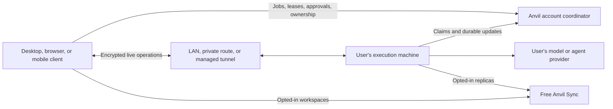

# Free Sync, free Mesh, and Anvil Cloud Agents

Status: initial local implementation verified; rollout and later transport phases remain. Updated 4 October 2026.

The user approved execution after revising the charging boundary: Sync and Mesh are free, and only
Anvil Cloud Agents will be charged for. Keep Anvil Cloud Agents disabled behind default-off flags for
PR91. The initial implementation covers the product boundary, workspace choices, website, and polling.
Machine endpoints follow the local verification sequence below. Managed tunnel rollout still requires
verified commercial pricing and capacity; this document does not authorise production provisioning,
billing changes to existing customers, or deployment.

Baseline: PR #91, branch `feature/sync-mesh--foundations`, commit
`afbe685dc5a1f1b771af41a5dcda51affa157725`. Infrastructure pricing checked 3 October 2026.

## Recommendation

The [host-local implementation plan](host-local-sync-mesh-implementation-plan.md) now defines the
future architecture and delivery sequence. The transport-only hybrid and its cost tables below are
historical baselines. This document retains the approved product boundary and initial implementation
record; later architecture decisions defer to the new plan.

Make Anvil Sync and Mesh part of the free offering. Users can connect their own fleet, including
machines in their own cloud accounts, sync portable workspace configuration, and use supported
provider cloud agents without an Anvil subscription. They continue to pay their providers directly.
Anvil earns revenue later from **Anvil Cloud Agents**, the execution machines Anvil supplies.
**Anvil Cloud** remains the TypeScript framework's name.

For PR91, remove subscription and preview-expiry gates from Sync and Mesh end to end. Retain
account authorisation, device trust, lifecycle checks, fair-use controls, and bounded resource limits.
Do not convert a canceled or missing subscription into an access restriction. Disable new paid Sync
checkout so stale clients cannot accidentally buy the retired offering. Preserve existing billing
history, portal access, and cancellation paths where needed; do not mutate existing subscriptions or
issue refunds in this implementation. Existing subscriptions and already-open Stripe checkout
sessions need an explicit operational cutover to stop future legacy charges; blocking new checkout
requests does not cancel those resources.

The initial increment reduces polling and prototypes private machine access. The next plan moves
live traffic and detailed execution history to hosts, compacts Sync, and retains necessary durable
coordination and recovery. Managed tunnels need a verified commercial price and capacity limit
before wider rollout.

For the heavy usage model below, the current design forecasts about **$2.10 to $3.35 per user per
month** before shared allowances. An optimised version forecasts **$0.55**. A transport-only hybrid
forecasts **$0.42 plus tunnel charges**. These are scenarios built from code and assumptions, not
production measurements. All free users' infrastructure costs now require an operator budget or
contribution from future Cloud Agent sales.

## Product and charging boundaries

| Capability | Charging boundary |
| --- | --- |
| Local Anvil, own API keys, and supported providers | Free; providers bill the user for model usage |
| Supported provider-native cloud agents | Free Anvil integration; provider charges remain the user's responsibility |
| Mesh on the user's desktops, servers, and cloud-hosted machines | Free, including ordinary hosted coordination and compatible fallback |
| Pairing, trust, revocation, leases, approvals, cancellation, and handoff | Free account and execution infrastructure |
| Anvil Sync | Free portable workspace definitions, templates, agents, settings, and selected replica setup |
| Manual workspace setup and task-scoped remote preparation | Free, with no requirement to enable ongoing workspace Sync |
| Anvil Cloud Agents | Future paid hosted execution, separately metered; default-off for PR91 |
| Self-hosted backend and private routes | Available without an Anvil subscription; operator pays infrastructure costs |

OpenRouter, LLMGateway, and Azure Foundry are useful provider choices for hosted execution. Retain
all supported providers. An API gateway supplies model access, not an execution machine. Provider
native cloud execution and users' own cloud-hosted workers remain free integrations.

Workspace creation offers explicit choices to keep the workspace local or enable Anvil Sync. Local
is the default until the user selects Sync. Explain which configuration leaves the machine and how
replicas are prepared. Existing synced workspaces retain their selections and data. Unsynced
workspaces need explicit adoption. Signing in or enabling account Sync must not adopt every workspace.

Sync currently replicates workspace definitions, workflow templates, custom agents, selected app
settings, and required encryption/pairing records. Repository files, credentials, local paths, and
chat transcripts are not portable Sync entities. Repository cloning uses each machine's own access
and approvals. Do not market this as file backup or arbitrary chat-history replication.

An unsynced workspace can submit a remote job. Transfer only its selected sealed context and pinned
repository manifest. Destination setup must not opt it into ongoing Sync. Bounded Mesh artifacts and
handoff checkpoints remain free execution infrastructure. Stopping workspace Sync pauses future
replication; deleting hosted copies requires a separate explicit action. It does not remove local work.

There is no personal or team Sync subscription to sell. Future hosted compute pricing must account
for runtime, startup, disk, cleanup, and support separately. Do not promise unlimited execution or
invent an Anvil Cloud Agents price before the execution platform and unit economics are verified.

## Website and app copy

Update the pricing page, metadata, homepage/product sections, docs, account pages, onboarding, and
feature-denial messages together. Remove the £8/month and £80/year Sync offering, paid team Sync
cards, preview admission as the reason Sync is free, and the Halloween 2026 expiry promise.

Use plain, consistent product copy:

- "Anvil Sync and Mesh are free. Sync your workspace configuration and run agents on your own machines."
- "Use your existing providers and cloud agents. Your provider's usage charges still apply."
- "Anvil Cloud Agents will provide hosted execution. They are not available in this release."
- "Choose which workspaces to sync. Repository files, local credentials, and chat history stay outside workspace Sync."

Use download, sign-in, setup, and documentation calls to action for free features. Remove checkout
buttons for new Sync subscriptions. Existing subscriptions can display historical billing with portal
and cancellation controls, but never imply they are necessary to keep using Sync or Mesh. Account
security and fair-use restrictions still need accurate messages. Do not describe an unavailable Cloud
Agent as an enabled paid upgrade.

## Machine access and retained coordination

The earlier hybrid proposal separates discovery and connection bootstrap from live application
traffic. An authenticated machine endpoint serves interactive HTTP and WebSocket operations while
Anvil retains durable cross-machine jobs and handoff. The new implementation plan extends that
proposal with compact Sync storage and an explicit split between local detail and hosted recovery.

Managed tunnels still carry traffic through Cloudflare's proxy. Public HTTP origins terminate
transport encryption at the proxy, so retain application encryption for confidential payloads.
Route large artifacts through suitable private connections or bounded R2 transfers.
[Cloudflare routing](https://developers.cloudflare.com/tunnel/concepts/routing/).

The following table records the earlier transport-only scope for comparison:

| Responsibility | Current PR91 | Proposed hybrid |
| --- | --- | --- |
| Account identity and device enrollment | Hosted backend | Hosted backend, independent of Sync purchase |
| Device trust and encryption keys | Account protocol and local keyring | Same trust rules across every transport |
| Job acceptance, leases, attempt fences, approvals, and ownership generations | Durable account coordinator | Retain durable account coordinator |
| Live output and machine workspace operations | Account transport for hosted flows; existing companion LAN/private routes | Machine endpoint over LAN/private network or managed tunnel; account fallback |
| Handoff | Durable state machine and sealed checkpoint | Retain state machine; transfer checkpoint over an authorised route |
| Portable workspace replication | Sync journal and local materialisation | Free Sync, explicitly enabled per workspace |
| Execution and provider secrets | Destination machine | Destination machine |
| Durable results and artifact recovery | Coordinator and R2 | Retain bounded durable records and necessary artifact storage |

This keeps Mesh peers equal while giving each execution machine authority over its own files and
processes. No master desktop or replacement coordinator election is needed. A fully peered deployment
is possible with a user-operated, sufficiently available coordinator, but removing all hosted
coordination changes offline queueing, browser discovery, and recovery availability. Do not make that
the first implementation if preserving today's functionality is the requirement.

## Initial implementation sequence

Step 1 records the approved product work. Remaining transport steps describe the initial narrower
proposal; use the [new delivery sequence](host-local-sync-mesh-implementation-plan.md#delivery-sequence)
for further implementation.

### 1. Correct the PR91 product boundary

Resolve active account Sync/Mesh access independently of preview deadlines, subscriptions, seats, and
billing provider health. Preserve the existing capability contract where practical. Reject deleted
or deleting accounts and keep operator restrictions separate from billing. Do not make a generic
billing lookup failure prevent free account operations.

Keep trust and key distribution/rotation available for free. Retain local trust verification and
fail-closed revocation handling. Audit every backend mutation, artifact upload, websocket, account
page, desktop pause gate, and CLI/headless flow that previously relied on paid entitlement state.

Persist per-workspace Sync choice and carry it through creation, settings, adoption, materialisation,
replica advertisement, and write/application logic. Migrate existing bindings without changing local
data or entity identity. Test opt-out, re-enable, and remote setup of workspaces that never joined Sync.

Disable Anvil Cloud Agent create, scheduling, resume, and provisioning paths behind default-off flags
in the UI, desktop services, backend, and provisioner. Gate Anvil-supplied execution only. Keep users'
own machines, including cloud-hosted machines, and supported provider cloud agents available. Keep
cleanup, suspension, cancellation, and deletion working for existing resources. Preserve persisted
wire target identifiers and leave the unrelated Anvil Cloud framework feature flag alone.

Main entry points include the entitlement contract, hosted policy/enforcement and billing routes,
account coordinator, Sync runtime, workspace service/schema/UI, remote chats, cloud environment
services/provisioner, and website pricing/account/docs. Extend meaningful tests around these boundaries.

The free hosted service retains the current five-device allowance. Organisations use five allocated
member places as a fair-use bound, independent of payment or the old preview deadline. New website
organisations include the owner within those five places; historical explicit owner opt-outs remain
honoured. These bounds do not introduce an upgrade charge. Retain legacy cancellation and portal
support, and arrange a separate billing cutover if any existing subscriptions are still renewing.

Current organisations manage membership, roles, invitations, and legacy billing administration.
They are optional for personal Sync and Mesh. They do not share workspace data, devices, or Cloud
Agents between members. Keep that distinction explicit in account copy and do not present membership
administration as a shared-fleet pricing benefit. Organisation-scoped workspaces, machine pools,
permissions, and compute billing need a separate design and implementation.

Acceptance requires an unsubscribed account beyond the previous preview deadline to enroll trusted
devices, sync opted-in workspaces, submit and complete work, approve it, cancel it, and hand it off.
Subscription cancellation and billing outages must not disable those operations. Revocation, fair-use
restriction, account deletion, and explicit Cloud Agent flags must still enforce their separate rules.
Test stale checkout calls and mixed client versions. Update the website to reflect the same behaviour.

### 2. Measure and reduce the existing transport cost

Record backend operations by type, Worker CPU, billable DO requests, billed awake duration, row reads
and writes, stored bytes, R2 operations, browser grants, reconnects, and active attempts. Use bounded
aggregate metrics without payloads or secrets. Separate account objects from the shared session
coordinator. Include alarms, retries, index writes, and deletes. Reconcile the model to an actual bill.

Replace the three-second device roster refresh and two-second job/approval polling with a shared local
cache updated by account events. Use bounded catch-up on reconnect and a slower fallback when live
events are unavailable. Stop view-specific polling when the view closes. Avoid launching one network
poller per component for the same account.

Wake browser command consumers from durable command availability, with a catch-up fallback. Preserve
the approval and grant-expiry checks. Audit recurring timers and pending I/O that prevent DO
hibernation. Keep lease renewal and cancellation safety; extend cadences only after proving the
failure-detection trade-off acceptable. Polling optimisations must not delay key rotation before a
write or permit revoked devices to continue as trusted peers.

Run replayable idle, interactive, streaming, reconnect, and browser-grant workloads over three
devices. Set a provisional planning target below $0.60 marginal infrastructure cost for the model
below. Replace that target if measured workload or provider pricing disproves it.

### 3. Prototype a narrow machine endpoint

The first local increment is a default-off `ANVIL_MESH_MACHINE_ENDPOINTS` route on the existing
companion server. It reports the persisted machine identity and lets an already paired or enrolled,
authorised client wake the coordinator-backed command queue for an approved grant. It accepts no
caller-supplied execution payload and returns sealed result envelopes through the existing receipt
and fence checks. This is a private-route prototype, not a completed direct transport: browser
bootstrap, client proof keys, HTTPS discovery, live payload streaming, and managed tunnels still need
the work below. Keep the flag off until real two-device acceptance passes.

Reuse existing companion server and workspace executor behaviour where appropriate. Expose only
typed, authorised Mesh/workspace operations. Bind the tunnel origin to loopback. Do not expose an
arbitrary host service, shell proxy, or caller-supplied URL.

Use a stable machine identity independent of hostname, connector process, and endpoint. Negotiate
capabilities and protocol versions. Pairing and browser grants must remain scoped to an approved
device, workspace, operations, and expiry. Preserve local user approval. Use one-time, short-lived
bootstrap credentials bound to the client key, request nonce, and destination identity. Document the
broker signing-key trust assumption instead of describing the broker as unable to grant access.

Carry application encryption through the endpoint. Validate origin and authority, prevent replay,
reject redirects in broker health/credential requests, and check the destination's identity. An HTTPS
browser needs an HTTPS endpoint; do not assume a plain HTTP LAN server works from the hosted web app.

Start with a verified LAN/private route between two desktops. Exercise disconnect during an accepted
command, replay, revoked credentials, and mixed versions before adding managed tunnels. Keep durable
job submission at the coordinator. Transport retry must reuse command IDs and cannot rerun accepted
side effects simply because the response was lost.

### 4. Add managed tunnels behind a separate rollout flag

Use the existing Cloudflare backend and database unless the prototype demonstrates a specific need
for another service. Keep connection brokerage separate from execution traffic.

Implement persisted allocation generations, idempotent provisioning, staged external-resource
creation, retries, startup reconciliation, and cleanup that cannot delete a newer allocation. Unlink
revokes authorisation before resource teardown. Distinguish offline from unlinked. Reclaim idle tunnels
only for hosts that can recover their endpoint on wake or restart. Bound allocations per account and
allocate only to exposed execution hosts, not every viewing device.

Before production rollout, obtain written pricing for the chosen tunnel product, confirm whether
offline allocations are billable, and verify account-wide tunnel/DNS limits and supported traffic.
Test at the expected host count. Keep allocation costs and orphaned resources visible to operators.

### 5. Move live operations to endpoints and roll out gradually

Prefer a verified private route, then the managed endpoint, with existing account transport as a
compatible fallback. Browsers can use the managed HTTPS endpoint where private routes are unavailable.
Route live chat/output and approved workspace operations there. Keep durable jobs, approvals,
cancellation intent, leases, ownership, and required results at the coordinator.

Exercise these acceptance cases before expanding beyond a small opt-in cohort:

| Scenario | Required outcome |
| --- | --- |
| Submitting device closes after durable acceptance | Destination can finish and publish a recoverable result |
| Destination offline | Job remains durably queued; UI reports offline accurately |
| Stream or tunnel disconnects mid-command | Reconnect recovers status; request deduplication prevents duplicate execution |
| Network partition during handoff | Existing fences and ownership generations prevent simultaneous authorised owners |
| Revoked device with cached credentials | Online checks and bounded credential expiry enforce revocation; no claim of instant offline revocation |
| Subscription expires | Free Sync and Mesh continue without deleting local work |
| Endpoint unavailable or old client | Compatible fallback retains permissions and durable job identity |
| All user machines offline | Hosted control records remain available; live machine operations wait for a machine |

Measure p50/p95 latency, fallback rate, billed duration, total requests, security failures, and tunnel
allocation lifetime. Compare identical workloads before and after each phase. Rollback must return to
account transport without losing job IDs, encrypted artifacts, ownership, or workspace choices.

## Cost comparison

The [4 October detailed FinOps projection](finops-projection.md) supersedes the financial
subtotals below for budgeting. It includes session-validation calls, the remaining main-process
chat poller, DAU/MAU and retained-account assumptions, shared services, operating time, and
startup-credit expiry. The earlier tables below remain historical architecture sketches; do not
combine their figures with the newer forecast.

### Usage model and code evidence

The model uses 30 days, eight hours each day, and three enrolled desktops online simultaneously.
Each keeps a workspace chat view open; one shows a remote job and one worker runs an active attempt
throughout the eight hours. This is a deliberately heavy case. It is not equivalent to eight total
device-hours split across three machines. A phone-only viewer may generate different traffic.
It includes a light replication/control allowance, but excludes Anvil Cloud Agent execution and
provider model charges. An account with workspace Sync disabled may use less traffic; required trust and control traffic remains.

The existing spec's two hours of monthly execution and ten jobs per month do not cover this usage.
Job concurrency, output rate, view lifetime, browser grants, and retained state matter more than the
number of registered devices alone.

| Existing activity | Backend traffic over this month |
| --- | --- |
| Three chat device selectors refresh every 3 seconds; `listDevices` calls both `device.list` and `security.get` | 1,728,000 HTTP RPCs |
| One remote-job view refreshes job and approvals every 2 seconds | 864,000 HTTP RPCs |
| Live Sync fallback runs every 60 seconds on three devices | 43,200 cycles; about 172,800 baseline RPCs, with extra calls depending on recovery/grant state |
| Three workers refresh 90-second worker leases, typically about every 60 seconds | About 43,200 RPCs; timing/reconnects can increase this |
| One active worker renews attempts and checks cancellation every 30 seconds | 57,600 RPCs; renewals are batched, cancellation reads scale with active attempts |
| One approved, unexpired browser workspace grant, if present, claims commands every 1.5 seconds | An extra 576,000 RPCs per month; excluded from the base model |

The first five rows total about 2.87 million RPCs. Round to 3 million for other work and retries.
This is not a universal background rate. The relevant views, attempts, and grants must exist, requests
can overlap or be delayed, and actual telemetry may be lower or higher.

Source pointers: [chat polling](../../../src/renderer/components/chat/useChatRunTarget.ts),
[device/security reads, Sync cadence, and browser claims](../../../src/main/services/sync-runtime.service.ts),
[worker renewal and cancellation checks](../../../src/main/services/mesh-worker.service.ts).

The account backend already uses `acceptWebSocket`, so connected time is not automatically billed
awake time. Its coalescing and delivery timers need measurement. Incoming socket frames also incur
DO work, while outgoing frames do not incur request charges. Three sockets share one account object's
duration; do not multiply account awake time by three. The shared session coordinator needs separate
duration accounting.
[Current coordinator](../../../cloud/backend/src/account-coordinator.ts).

### Rates and allowances

Infrastructure costs below are in USD, exclude tax, and assume one Workers Paid operator account.
Allowances belong to the operator, not to each Anvil user. Other workloads in that account consume them.

| Meter | Included monthly usage | Rate above allowance |
| --- | --- | --- |
| Workers Standard | $5 shared monthly minimum; 10 million requests; 30 million CPU ms | $0.30/million requests; $0.02/million CPU ms |
| DO requests | 1 million billable requests | $0.15/million |
| DO duration | 400,000 GB-s | $12.50/million GB-s |
| DO SQLite | 25 billion row reads; 50 million row writes; 5 GB-month | $0.001/million reads; $1/million writes; $0.20/GB-month |
| R2 Standard | 10 GB-month; 1 million class A; 10 million class B operations | $0.015/GB-month; $4.50/million A; $0.36/million B; no egress charge |

Workers rates: [official pricing](https://developers.cloudflare.com/workers/platform/pricing/).
DO rates: [official pricing](https://developers.cloudflare.com/durable-objects/platform/pricing/).
R2 rates: [official pricing](https://developers.cloudflare.com/r2/pricing/).

DO incoming WebSocket messages use a 20:1 request billing ratio. Round DO excess usage up to its
documented billing units; duration overage can trigger a $12.50 step. R2 also rounds billable units.
These steps explain why a per-user marginal rate differs from a small deployment's invoice forecast.

Ordinary WorkOS AuthKit currently includes the first million monthly active users. Enterprise SSO,
support arrangements, and other paid features have separate prices.
[WorkOS pricing](https://workos.com/pricing).
The existing D1 auth/billing database remains in every option. Its activity, logging, notifications,
domains, monitoring, support, and engineering are outside the subtotal below and require a separate
shared budget. Additional shared session-object awake duration is also outside the subtotal; its
request usage is covered by the aggregate DO request budget. [D1 pricing](https://developers.cloudflare.com/d1/platform/pricing/).

### First polling increment and later targets

The first renderer change shares per-resource request loops and uses a 15-second device-roster
fallback, five-second active job/approval fallback, and immediate job refresh on status events.
Provider settings refresh every 15 seconds; local remote-chat lists every five seconds. Consumers
stop their loop on disposal; completed job polling stops. The server does not yet emit a complete
roster/approval invalidation stream. Those fallback cadences are not the fully event-driven B target.

For the same heavy profile, roster calls become about 345,600/month and job/approval calls about
345,600/month. With the current runtime/security, worker and attempt checks, the subtotal is about
964,800 HTTP calls before other work, so budget roughly one million. Using 1.5 million DO billable
requests, 10 million row reads, and the same CPU/write/storage/10% awake assumptions gives roughly
**$0.98 marginal/user/month**. Deployment subtotals are about **$76 for 100**, **$918 for 1,000**, and
**$9,747 for 10,000** matching heavy users. These remain modelled costs, not benchmark evidence.

The B and C tables below are later targets. Achieving B needs more complete event-driven cache
invalidation and measured request reduction; achieving C also needs machine-endpoint routing and
measured hibernation improvement. The first polling increment does not establish either result.

### Forecast inputs, not measured performance

| Monthly input per heavy user | A: current | B: optimised current | C: transport-only hybrid |
| --- | ---: | ---: | ---: |
| Worker HTTP requests | 3,000,000 | 300,000 | 301,000 |
| Mean Worker CPU per HTTP request | 5 ms | 5 ms | 5 ms |
| DO billable requests, including internal calls and socket message discount | 3,500,000 | 500,000 | 460,000 |
| Account DO awake fraction of the eight-hour daily window | 10% baseline; 100% stress case | 10% target | 1% target |
| DO SQLite row reads | 30,000,000 | 3,000,000 | 3,000,000 |
| DO SQLite row writes | 200,000 | 200,000 | 200,000 |
| Mean retained DO SQLite data | 20 MB | 20 MB | 20 MB |
| Mean retained R2 artifacts | 100 MB | 100 MB | 100 MB |
| R2 class A / B operations | 600 / 3,000 | 600 / 3,000 | 600 / 3,000 |

A's request allowance follows the observed pollers. Additional DO calls, CPU time, rows touched,
storage, and awake fractions are modelling assumptions. The DO request budget allows roughly one
incoming live frame per second during execution and extra internal coordination requests.

B removes repeated UI polls but keeps leases, safety checks, and catch-up. Its 300,000 requests are a
target, not a result of an implemented optimisation. C adds a small broker budget and removes live
frames from Anvil's coordinator. It assumes this reduces awake time from 10% to 1%. If measurement
does not show that duration improvement, the saving over B nearly disappears. Lease and durable-state
writes remain in all options. Large result histories or frequent checkpoints require a different
storage/write model.

At Cloudflare's 128 MB example allocation, one account awake for all eight hours daily consumes
110,592 GB-s/month, a gross marginal duration cost of $1.3824. At 10% it is $0.13824; at 1% it is
$0.013824. This is duration for one account object, excluding separate objects and activity outside
the model window. It is not the allocated execution machine's RAM.

| Forecast before shared allowances | USD per heavy user/month |
| --- | ---: |
| A, 10% awake | $2.10 |
| A, continuously awake during the eight hours | $3.35 |
| B | $0.55 |
| C | $0.42 + allocated tunnel charges |

### Deployment subtotal after shared allowances

These are modelled monthly subtotals for Workers, account-coordination request usage, account-object
duration, DO SQLite, and R2. They include the shared $5 minimum, assume unused allowances, and apply
documented DO/R2 rounding. They exclude the shared costs listed above and tunnel charges.

| Identical heavy users | A, 10% awake | A, continuously awake | B | C before tunnels |
| ---: | ---: | ---: | ---: | ---: |
| 100 | $186 | $311 | $33 | $20 |
| 1,000 | $2,023 | $3,273 | $488 | $358 |
| 10,000 | $20,947 | $33,385 | $5,377 | $4,071 |

An extra browser grant adds 576,000 current claim calls, approximately $0.26/month in Worker/DO
request charges before CPU, duration, storage effects, and allowances. One grant on each of three
devices adds about $0.78 in request charges alone. Replace this busy polling path in B as well as C.

This does not say that 1,000 typical users cost $2,023. It says that 1,000 users matching the deliberately
heavy profile do. Measure the distribution of active time and open views before using it as a sales
forecast. If eight hours is split among devices, device-specific polls decrease. Account awake
duration depends on overlapping activity and does not necessarily divide by three.

### Tunnel price sensitivity

The exact tunnel product, commercial agreement, allocation limits and traffic terms for Anvil must
be confirmed. An advertised free tunnel capability is not a quote for managed customer-host
allocations at this scale. Keep tunnel charges as a separate sensitivity until verified.
[Cloudflare Tunnel](https://developers.cloudflare.com/tunnel/),
[account limits](https://developers.cloudflare.com/cloudflare-one/account-limits/).

Let `T` be the effective USD cost per allocated host tunnel per month. C's marginal forecast is
`$0.4155 + H × T`, where `H` counts exposed execution hosts. A phone or browser acting only as a
client needs no host tunnel. The examples assume allocations remain for the month; recoverable idle
cleanup may reduce them if the vendor prorates billing.

| Illustrative T, not a vendor quote | One exposed host | Three exposed hosts |
| ---: | ---: | ---: |
| $0.00 | $0.42 | $0.42 |
| $0.10 | $0.52 | $0.72 |
| $1.00 | $1.42 | $3.42 |

Under these assumptions, C saves only about $0.13/user/month over B before tunnels. For three hosts,
the tunnel cost must be below roughly **$0.043 per host-month** for C to be cheaper. Against the
unoptimised A baseline, the threshold is about $0.56 per host-month. This is why polling reduction is
the first cost intervention. Machine endpoints may still justify their maintenance cost through
latency, browser access, and sustained streaming capacity.

At 1,000 heavy users and three allocated hosts each, a $0.10 tunnel rate adds $300/month to C; a $1 rate
adds $3,000/month. Confirm capacity for 3,000 allocations before treating that cohort as feasible.

### Sustainability and commercial decision

Free Sync and Mesh are subsidised services whenever Anvil hosts coordination, configuration storage,
artifacts, or managed endpoints. Users' machines carry execution costs. Anvil still pays for the
coordination service and operations. There is no Sync subscription revenue to offset those costs.

Use the cohort subtotals above as explicit operating-budget scenarios. At 1,000 heavy users, B needs
about $488/month before shared operations and support. C needs about $358/month plus tunnels. A free
launch needs an allocated budget even while Cloud Agents are disabled. Inactive accounts are cheaper;
measure the active-use distribution before treating the heavy cohort as a sign-up forecast.

For illustration, assume a future Cloud Agent purchaser contributes $8/month after all execution,
payment, tax, and support costs specific to their compute. This is a margin assumption, not a price
quote or conversion of a former Sync price. Covering 1,000 equally heavy free users' infrastructure
would require about 253 such purchasers for A's 10% case, 62 for B, or 45 for C with zero tunnel fees.
C with three $0.10 tunnels per user would need about 83. Shared engineering, monitoring, support, and
profit increase those requirements. Do not confuse gross compute revenue with contribution margin.

Bound authenticated accounts, artifact sizes/retention, concurrent jobs, and exposed hosts. Publish
fair-use limits plainly. Pairing a user's own machine or syncing workspace configuration is not a
billable upgrade. Preserve self-hosting and private routes. Existing organisation administration
remains free. Shared organisation workspaces and fleets are not implemented by this change; any
future sharing feature follows the same boundary, with charges limited to Anvil-supplied compute.

Implement the free product boundary, workspace choice, website copy, and polling reduction first.
Adopt managed endpoints only when the local prototype preserves functionality and a real tunnel
quote fits the free-service budget. Keep Cloud Agents disabled until a chosen execution platform,
measured startup/runtime cost, and separate compute-margin calculation justify enabling them.

## Calculation notes

Use decimal GB and the 0.128 GB allocation in Cloudflare's pricing examples. Per account, the model
window contains `30 × 8 × 3,600 = 864,000` seconds. Account duration is
`864,000 × 0.128 × awake_fraction`. Multiply each usage input by the cohort size before subtracting
the operator's allowance. Never subtract an allowance for every user.

For DO/R2 meters, use `ceil(max(usage - allowance, 0) / billing_unit) × unit_rate`.
Workers request and CPU estimates use the published rates on excess usage. Add the $5 shared minimum
once, not separately for DO. Marginal figures apply rates without allowances or invoice rounding;
they also exclude the shared minimum. R2 storage remains in every option because necessary durable
results must survive a machine going offline.

The arithmetic was checked with a temporary Python calculation. No runtime benchmarks, production
usage export, tunnel quote, or deployment validation have been performed for this plan.

## Local verification and rollout status

The local implementation includes the free capability policy, retired checkout and seat changes,
default-off Anvil Cloud Agents, explicit workspace selection with preserved associations and conflict
reconciliation, task-scoped workspace setup, shared renderer polling, and matching website copy.
The narrow authenticated machine wake route is also implemented behind its own default-off flag.

- Desktop: full suite passed 1,958 tests with 12 skipped; the subsequently added in-flight workspace
  opt-out regression passed in the 28-test Sync engine suite. Both TypeScript projects, ESLint,
  Electron build, daemon build, and device-auth integration passed. Endpoint/companion acceptance
  checks passed after the final queue retry changes.
- Website: TypeScript, ESLint, 100-page documentation validation, browser-workspace tests (3),
  deployment-environment tests (13), and production build with webpack passed. The normal Turbopack
  build could not bind its build-process port in this environment, including on retry.
- Provisioner: 19 tests and TypeScript passed. Cloudflare recipe/provisioner generation: 62 tests
  and TypeScript passed.
- Backend: TypeScript and 416 tests across 38 files passed; hosted deployment/fair-use checks (24),
  deployment configuration self-check, and local protocol conformance (11) passed.

No deployment, existing subscription cancellation, refund, tunnel allocation, physical-device
acceptance, or production cost measurement was performed. Managed browser transport and tunnel
rollout remain phases 4 and 5; the endpoint prototype does not establish their cost targets.
