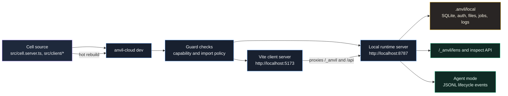
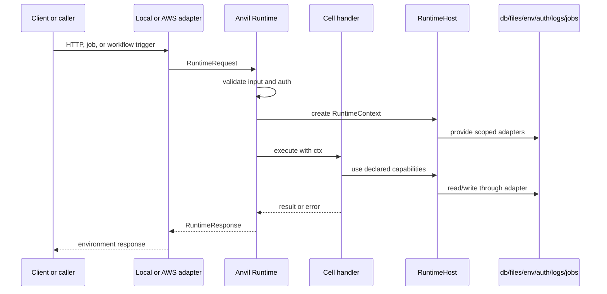
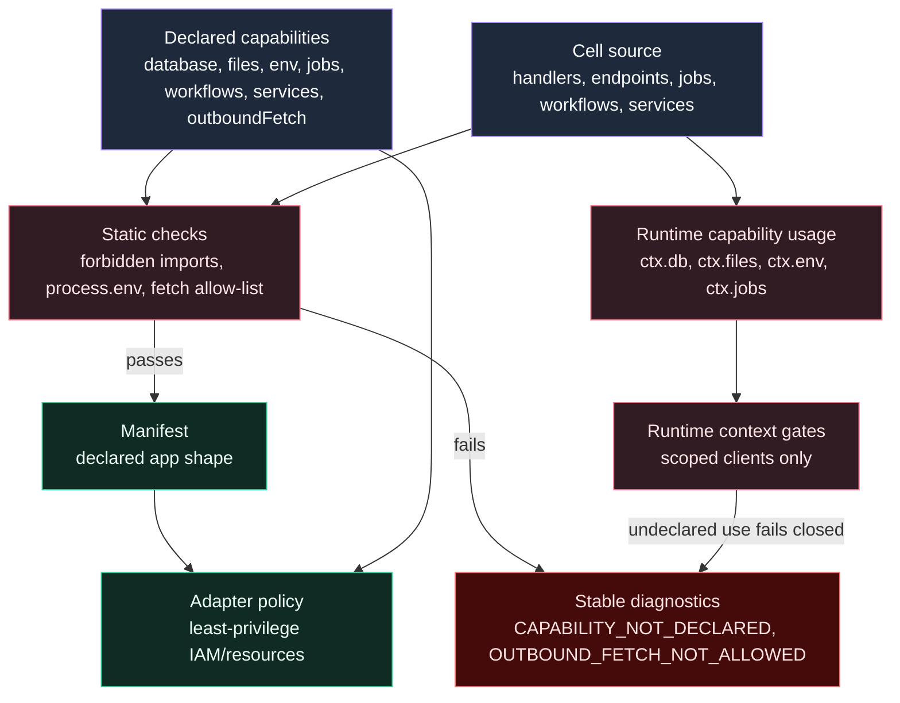
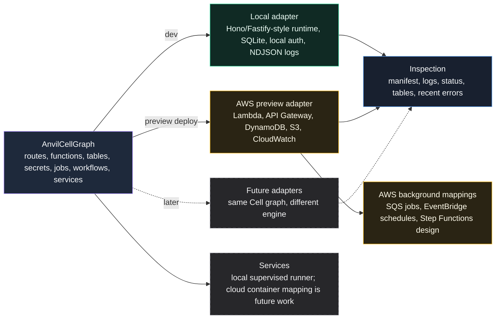

# Anvil Cloud Diagrams

These diagrams explain the current Anvil Cloud alpha architecture at the level
most useful for contributors, agents, and reviewers. They show the product
contract first: Cells declare intent, Builder and Guard turn that intent into
inspectable artifacts, Runtime executes through host adapters, and deployment
adapters map the same contract onto provider resources.

Editable draw.io sources live in [`../diagrams`](../diagrams/). They can be
opened in diagrams.net or from Anvil Desktop's diagram view.

## System Map

```mermaid
flowchart LR
  Developer["Developer or coding agent"]
  Cell["Anvil Cell project<br/>server DSL, React client, anvil.json"]
  Builder["Anvil Builder<br/>typecheck, bundle, manifest"]
  Guard["Anvil Guard<br/>imports, capabilities, policy"]
  Artifacts[".anvil artifacts<br/>server bundle, client assets, manifest, generated client"]
  Local["Anvil Local<br/>runtime server, Vite client, local adapters"]
  Lens["Anvil Lens<br/>manifest, logs, db, requests"]
  Adapter["Deployment adapter contract<br/>plan, deploy, remove"]
  AWS["AWS preview adapter<br/>Lambda, API Gateway, S3, DynamoDB, CloudWatch"]
  Remote["Remote inspect and logs<br/>stable JSON for humans and agents"]

  Developer -->|"authors"| Cell
  Cell -->|"compiled by"| Builder
  Cell -->|"checked by"| Guard
  Builder -->|"writes"| Artifacts
  Guard -->|"blocks unsafe code before output"| Artifacts
  Artifacts -->|"run locally"| Local
  Local -->|"feeds"| Lens
  Artifacts -->|"provider-neutral graph"| Adapter
  Adapter -->|"realizes capabilities"| AWS
  AWS -->|"reports"| Remote

  classDef actor fill:#0f172a,stroke:#38bdf8,color:#e5e7eb,stroke-width:2px;
  classDef cell fill:#1e293b,stroke:#a78bfa,color:#f8fafc,stroke-width:2px;
  classDef build fill:#18202f,stroke:#60a5fa,color:#f8fafc;
  classDef guard fill:#311c24,stroke:#fb7185,color:#ffe4e6;
  classDef run fill:#102a24,stroke:#34d399,color:#ecfdf5;
  classDef deploy fill:#2a2414,stroke:#fbbf24,color:#fffbeb;

  class Developer actor;
  class Cell cell;
  class Builder,Artifacts build;
  class Guard guard;
  class Local,Lens run;
  class Adapter,AWS,Remote deploy;
```

Use this when explaining the platform in one picture. The key point: AWS is an
adapter behind Anvil concepts, not the Cell authoring surface.

Draw.io source: [`anvil-cloud-system-map.drawio`](../diagrams/anvil-cloud-system-map.drawio)

## Local Development Loop

Local development proves the Cell model without requiring AWS credentials,
Docker, or raw provider resources. That lack of setup is intentional: local
should be boring enough to trust.

## Runtime Request Path

Every trigger becomes a `RuntimeRequest` before user code runs. That keeps local
dev, tests, Lambda, jobs, and future adapters on the same execution path instead
of growing one-off handler plumbing that quietly diverges.

Draw.io source: [`anvil-cloud-runtime-request-flow.drawio`](../diagrams/anvil-cloud-runtime-request-flow.drawio)

## Build And Deploy Pipeline

```mermaid
flowchart LR
  Check["anvil-cloud check<br/>JSON diagnostics"]
  Build["anvil-cloud build<br/>typecheck and bundle"]
  Manifest["Manifest and Cell graph<br/>provider-neutral"]
  Plan["anvil-cloud plan<br/>adapter diff"]
  Approval["Capability change review<br/>risky changes require approval"]
  Upload["Upload artifacts<br/>server bundle and client assets"]
  Provision["Provision adapter resources<br/>AWS preview today"]
  Inspect["inspect, logs, Lens<br/>runtime evidence"]

  Check --> Build
  Build --> Manifest
  Manifest --> Plan
  Plan --> Approval
  Approval --> Upload
  Upload --> Provision
  Provision --> Inspect
  Inspect -->|"feedback into source"| Check

  Guard["Anvil Guard"]
  Guard -.->|"fails unsafe imports, env access, undeclared capabilities"| Check
  Guard -.->|"blocks unsafe artifact output"| Build

  classDef command fill:#18202f,stroke:#60a5fa,color:#f8fafc;
  classDef artifact fill:#1e293b,stroke:#a78bfa,color:#f8fafc;
  classDef risk fill:#311c24,stroke:#fb7185,color:#ffe4e6;
  classDef deploy fill:#2a2414,stroke:#fbbf24,color:#fffbeb;
  classDef observe fill:#102a24,stroke:#34d399,color:#ecfdf5;

  class Check,Build,Plan command;
  class Manifest artifact;
  class Guard,Approval risk;
  class Upload,Provision deploy;
  class Inspect observe;
```

This is the delivery loop. The adapter receives a Cell graph and artifacts; Cell
authors never write Pulumi, AWS SDK calls, Terraform resources, CDK stacks, or
container definitions.

Draw.io source: [`anvil-cloud-build-deploy-pipeline.drawio`](../diagrams/anvil-cloud-build-deploy-pipeline.drawio)

## Capability Enforcement

Capabilities are the contract. Guard catches obvious unsafe behavior before
build output, adapters translate capabilities into provider policy, and Runtime
keeps handlers behind `ctx` instead of raw platform APIs.

## Adapter Mapping

The graph is deliberately provider-neutral. Pulumi is currently an AWS adapter
implementation detail, not something Cell authors touch.
